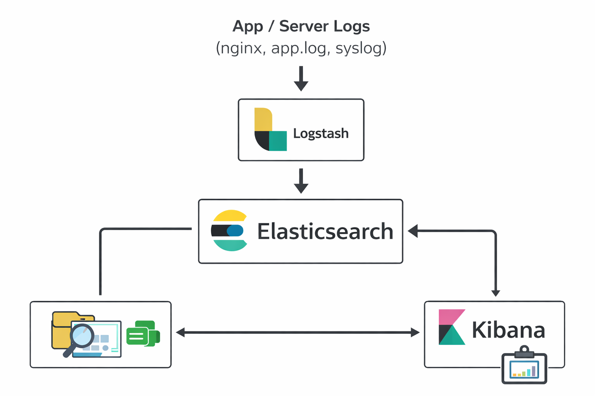
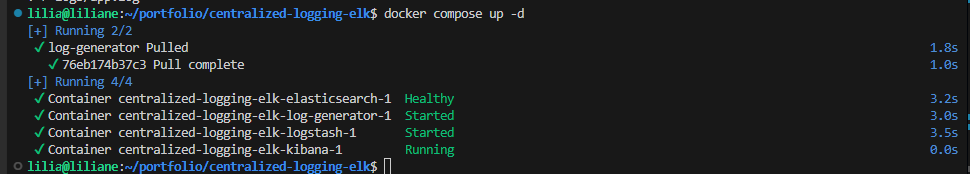
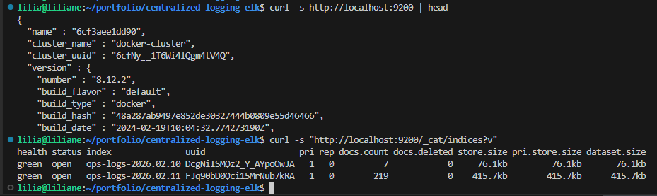
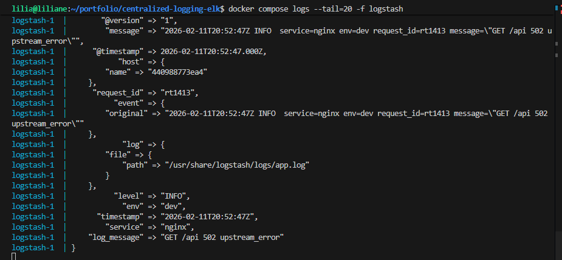
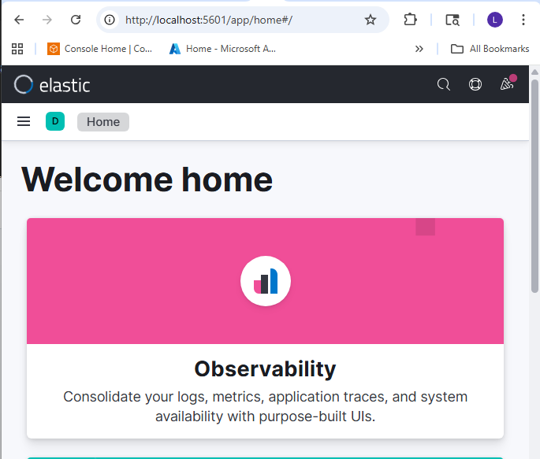
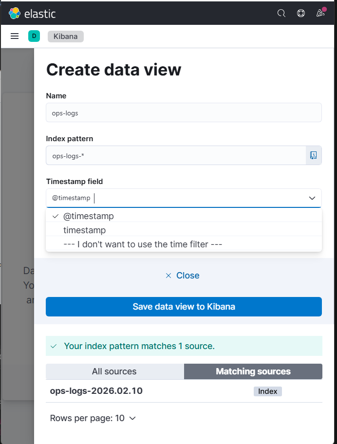
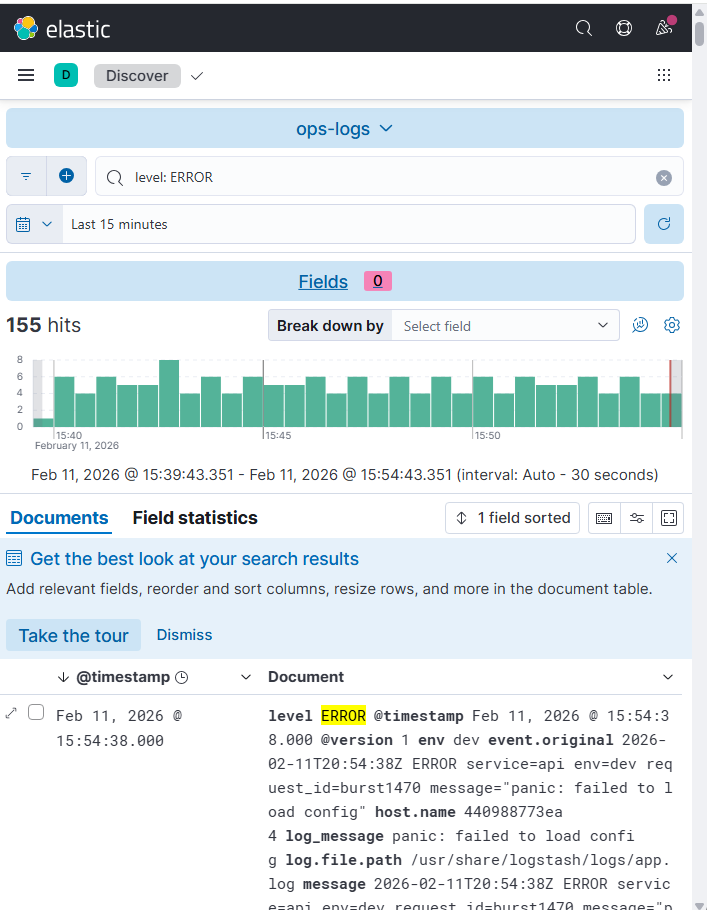
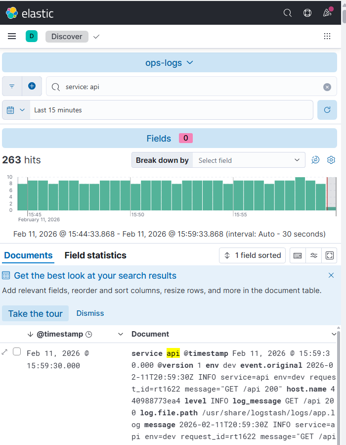
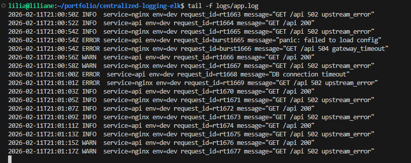

# Centralized Logging (ELK) — Real-Time “Ops” Incident Logging Stack

This project is my **centralized logging lab** using **Elasticsearch + Logstash + Kibana (ELK)** with a **real-time log generator**.

The goal is simple: in a real incident, I don’t want to SSH into 5 servers looking for one error.  
I want **one place** to search logs fast, filter by service, and prove what happened.

---

## Problem

When logs are scattered everywhere, incidents turn into a mess:

- I’m jumping between servers/containers trying to find “the one log line”
- Logs rotate or disappear before I can investigate
- It’s hard to answer basic questions quickly:
  - When did the errors start?
  - Which service is failing?
  - Is it one node or the whole system?
  - Are errors increasing or stable?

In real Ops, **slow log search = slow recovery**.

---

## Solution

I built a centralized logging stack using **ELK** with **real-time log creation**:

- **Log Generator (Alpine container)** writes logs continuously into `logs/app.log`
- **Logstash** tails that log file, parses it into fields (service, level, request_id, message)
- **Elasticsearch** stores and indexes logs for fast search
- **Kibana** lets me filter/search logs during incidents (Discover, filters, time range)

With this setup I can:

- Search by `service`, `level`, `request_id`
- Zoom into a time range when errors started
- Prove incidents with screenshots and exported queries

---

## Architecture Diagram



The diagram shows a centralized logging pipeline where server/app logs are ingested by Logstash, indexed and searchable in Elasticsearch, and explored through Kibana for fast troubleshooting and visibility.

---

## Project Structure

```text
centralized-logging-elk/
├── docker-compose.yml
├── pipeline/
│   └── logstash.conf
├── generator/
│   └── generate_logs.sh
├── logs/
│   └── app.log
└── screenshots/
    ├── 01-docker-compose-up.png
    ├── 02-elasticsearch-health.png
    ├── 03-logstash-running.png
    ├── 04-kibana-ui-home.png
    ├── 05-data-view-created.png
    ├── 06-discover-errors-filter.png
    ├── 07-service-filter.png
    └── 08-live-new-logs.png
```

---

## Step-by-step CLI

> **Target:** Local demo using Docker Compose (easy to run, easy to reproduce).
> **Folder name:** `centralized-logging-elk`

### 1) Create the project folders

```bash
mkdir -p centralized-logging-elk/{pipeline,generator,logs,screenshots}
cd centralized-logging-elk
```

### 2) Create the real-time log generator script

This script writes logs every 2 seconds and also creates “incident bursts”.

```bash
cat > generator/generate_logs.sh <<'EOF'


chmod +x generator/generate_logs.sh
```

### 3) Create Logstash pipeline config (parse logs into fields)

```bash
cat > pipeline/logstash.conf <<'EOF'

```

### 4) Create `docker-compose.yml` (ELK + log generator)

```bash
cat > docker-compose.yml <<'EOF'

EOF
```

### 5) Start the stack

```bash
: > logs/app.log
docker compose up -d
docker compose ps
```
`Screenshots/01-docker-compose-up.png`


### 6) Verify Elasticsearch is healthy

```bash
curl -s http://localhost:9200 | head
curl -s "http://localhost:9200/_cat/indices?v"
```
`Screenshots/02-elasticsearch-health.png`


> `yellow`, it’s normal for a single-node setup (replicas can’t be assigned).

### 7) Confirm Logstash is ingesting logs

```bash
docker compose logs -f logstash
docker compose logs --tail=20 -f logstash
```

Then confirm indices:

```bash
curl -s "http://localhost:9200/_cat/indices?v" | grep ops-logs || true
```
`Screenshots/03-logstash-running.png`


### 8) Open Kibana and create a Data View

1. Open Kibana: `http://localhost:5601`

`Screenshots/04-kibana-ui-home.png`


2. Go to **Stack Management → Data Views**
3. Create Data View:

   * Name: `ops-logs`
   * Index pattern: `ops-logs-*`
   * Time field: `@timestamp`

`Screenshots/05-data-view-created.png`


### 9) Discover logs and filter errors

1. Go to **Discover**
2. Filter:

   * `level: ERROR`

`Screenshots/06-discover-errors-filter.png`


3. Add another filter:

   * `service: api`

`Screenshots/07-service-filter.png`


### 10) Watch live logs in Kibana

The generator writes a new log every 2 seconds.
In Kibana Discover, refresh and you’ll see new logs continuously.

`Screenshots/08-live-new-logs.png`


Optional: confirm logs are being written on your host:

```bash
tail -f logs/app.log
```

---

## Outcome

After this setup:

* I have one place to search logs across services (Kibana)
* I can filter incidents fast (`ERROR`, `service=api`, time range)
* I can prove what happened with screenshots and queries
* This is reproducible and runs locally with Docker Compose
* I can simulate a real incident burst anytime (the generator does it automatically)

---

## Troubleshooting

### Elasticsearch index health is `yellow`

That’s normal in **single-node** mode because replicas can’t be assigned.
If you want it green:

```bash
curl -s -X PUT "http://localhost:9200/ops-logs-*/_settings" \
  -H 'Content-Type: application/json' \
  -d '{"index":{"number_of_replicas":0}}'
```

### Kibana loads but no logs show up

1. Check indices exist:

```bash
curl -s "http://localhost:9200/_cat/indices?v"
```

2. Confirm Logstash is ingesting:

```bash
docker compose logs -f logstash
```

3. Confirm Data View:

* pattern: `ops-logs-*`
* time field: `@timestamp`
* time range in Discover is not too narrow (try “Last 15 minutes”)

### Logstash keeps restarting

Check the logs:

```bash
docker compose logs logstash --tail=200
```

Most common cause is a grok parsing mismatch.
If your log format changes, update the `grok` pattern.

### No new logs appear (generator issue)

Check generator logs:

```bash
docker compose logs -f log-generator
```

Confirm the log file is growing:

```bash
wc -l logs/app.log
tail -n 5 logs/app.log
```

### Ports already in use (9200 or 5601)

Find what is using the port:

```bash
docker ps
```

Stop conflicting container:

```bash
docker stop <container_id>
```

Or change ports in `docker-compose.yml`.

---

## Cleanup

```bash
docker compose down
```

```
```
